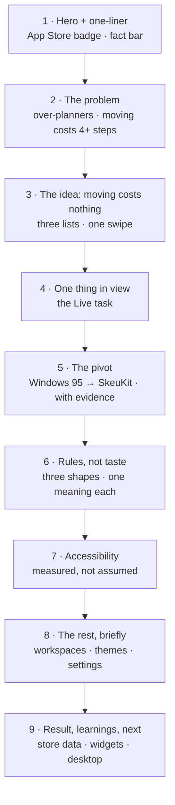
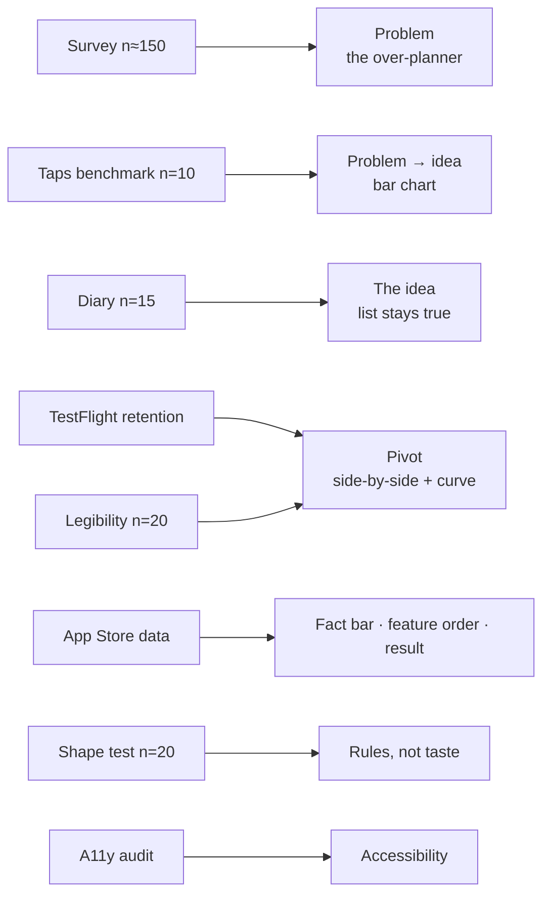

# to.morrow — case study upgrade plan

Plan for turning `public/to-shove2d.html` into a full case study, in the structural style of
Jason Yuan's write-ups (a spine, a map of the page, research condensed into models, every
decision sourced, captions that carry findings) at portfolio length and in a **neutral,
professional voice**. Written 2026-09-18 from an interview with Lucas. Companion to
`unify-casestudy-plan.md`; general guidance lives in the vault at
`04 Ressourcen/Design & Craft/Case Study Aufbau.md`.

`shove95casestudyplan.md` (2026-09-03) is the older content plan the current page was built
from. Its app description (§2) is still the reference for how the app works; this file
replaces its structure (§4) and adds the evidence layer the page is missing.

> **All numbers in this file are example values** showing the *shape* of a finding and
> where it would go on the page. Replace every one with the real result before it ships.

---

## 0. What the interview established

| Topic | Answer |
|---|---|
| Status | **Live on the App Store** |
| Spine | **Moving costs nothing.** Rescheduling as the primary gesture (recommended by me, see §1) |
| User | **People who over-plan.** Their Today list is always too full, and nothing gets moved |
| Pivot signal | TestFlight users found the Windows 95 build **hard to read**, and **stopped using it** |
| Include | An **accessibility section** (currently zero mentions on the page) |
| Not included | The App Store rejection story, naming the AI-assisted build. Settings and Workspaces stay |
| Craft focus | **The design system's rules** — three shapes, one meaning each. Already on the page, to be strengthened with evidence |
| Voice | Neutral professional |
| Assets | Windows 95 build screens (on the page as `windows1–9.webp`), early sketches, the four existing screen recordings |

## 1. The spine, in one line

**Why "moving costs nothing" and not the pivot.** The pivot is the strongest *story*, but it is
about the designer. The swipe is the *product insight*: the thing a reviewer should remember
the app by. Yuan does the same in Mercury: the breakthrough ("I was asking the wrong questions")
is a turning point inside a larger argument, not the argument itself. So the swipe is the
spine and the pivot is the centrepiece section.

Proposed hero line:

> **to.morrow makes moving a task to tomorrow a single swipe — so the Today list stays
> true, instead of being wrong by mid-morning.**

---

## 2. Target page structure

What happens to the current sections:

| Current section | Fate |
|---|---|
| At a Glance lead | Becomes the hero one-liner + fact bar |
| Problem (problem-1…4) | Keep the content; open with the over-planner as the named user; add the step-count benchmark (Study 2) |
| Live notifications (f1, f1b) | Moves **after** the swipe: the swipe is the spine, Live is the second feature |
| Order that costs nothing (f2, f2b) | Becomes section 3, the core. Gets the bucket-over-dates diagram |
| Workspaces, Settings (f3, f4) | Stay, as one compact section, ordered by measured use (Study 6) |
| Pivot (pivot-1…3) | Keep the honest wording ("there was no reason for it"). Replace "the longer I watched" with the evidence from Studies 4 and 5 |
| Type and icons | Becomes the last beat of the pivot: *what survived* (retro mode, chrome only) |
| Drei Formen (dna) | Section 6, the craft section, with Study 7 as proof |
| Colour ("Not just grey") | Folds into section 8, one paragraph plus the colour fan |
| Conclusion 1–4 | Keep 1, 2 and 4. **Rewrite 3**, which says nothing concrete. Add the store result |

---

## 3. Research programme

Eight studies. Each entry: **why**, **how**, **what to measure**, **what to show**, an
**example result**, and **what it changes on the page**.

### Study 1 — The over-planner, quantified

- **Why:** give the named user a number. "Nobody moves anything" is a claim until it's measured.
- **How:** survey, ~150 people who use a to-do app daily. Questions: How many tasks on your Today list this morning? How many will you finish? What happens to the rest (move / leave / delete)? How do you move a task to another day?
- **Show:** one sentence stat plus a **stacked bar** "What happens to unfinished tasks".
- **Example result:** median 9 tasks planned, 5 done; 62 % of the unfinished are left in place rather than moved.
- **Page change:** opens the problem section and defines the user: "over-planners — median 9 tasks planned, 5 done, the rest left where they are."

### Study 2 — What moving a task costs, app by app

- **Why:** the strongest visual argument available, and cheap to produce. "Four steps" becomes a comparison a reviewer grasps in two seconds.
- **How:** benchmark, 10 participants, each moves the same task to tomorrow in Reminders, Things, Todoist and to.morrow. Count taps and time.
- **Show:** a **horizontal bar chart: taps to move one task to tomorrow**, with to.morrow's single bar in the accent colour. Direct labels, no legend.
- **Example result:** Reminders 5 taps / 6.8 s · Things 4 / 5.1 s · Todoist 3 / 3.9 s · to.morrow 1 / 0.9 s.
- **Page change:** sits between the problem and the idea. **Caption:** "Moving one task to tomorrow. Everything else here is built around the bottom bar."

### Study 3 — Does the Today list stay true?

- **Why:** the claim "the Today list is wrong by mid-morning" is the product's promise. Test it.
- **How:** diary over 2 weeks, 15 over-planners. Week 1 with their usual app, week 2 with to.morrow. At 11:00 and 17:00, log how many Today tasks are still realistic for today.
- **Show:** a **two-line chart across the day**: share of Today tasks that are still realistic, usual app vs to.morrow.
- **Example result:** at 17:00, 41 % realistic with the usual app, 83 % with to.morrow.
- **Page change:** the evidence under the idea section. It turns "stays true" from a slogan into a measured claim.

### Study 4 — The pivot: Windows 95 vs SkeuKit (retention)

- **Why:** you said testers stopped using the Windows 95 build. That's a retention signal; show it.
- **How:** TestFlight data from both builds: the share of testers still opening the app after 1, 3, 7 and 14 days. Plus 3–5 short tester quotes about the old build.
- **Show:** the **side-by-side Windows 95 vs SkeuKit, same screen** (the page's most important image), and next to it a **retention curve with two lines**.
- **Example result:** day-7 retention 24 % on the Windows 95 build, 61 % on SkeuKit.
- **Page change:** replaces "the longer I watched, the clearer it got" (pivot-2) with the curve and one quote. **Caption example:** "Same features, same testers. Only the interface changed."

### Study 5 — The pivot: legibility

- **Why:** the second signal testers gave, "hard to read". It also justifies why retro mode survives on chrome only.
- **How:** reading test, 20 participants. The same task list in W95FA at the build's 2× pixel scale vs the system font. Measure reading time and errors reading back quantities and dates.
- **Show:** a **pair of numbers** (reading time, errors) next to a crop of each typeface.
- **Example result:** 38 % slower and 3× the errors in W95FA.
- **Page change:** closes the pivot. It explains the rule that survived: pixel type on chrome only, task text always in the system face.

### Study 6 — App Store usage data (live)

- **Why:** the app is live. Real usage is the result section, and it tests the spine.
- **How:** App Store Connect plus an anonymous event count in the app: share of task actions by type, median session length, Live task adoption, retention.
- **Show:**
  - **the fact bar** in the hero: three numbers
  - a **sorted bar chart: share of all task actions** (swipe, add, complete, edit, reorder, photo)
  - **median session length** as one big number
- **Example result:** swipes 58 % of all task actions · median session 14 s · 46 % of active users use the Live task · day-30 retention 31 %.
- **Page changes:**
  - "58 % of actions are swipes" is the proof that the spine is what people actually use.
  - "Median session 14 s" proves the problem-1 principle, an app you want to spend the least time in, with a number.
  - Workspaces and settings get their share from this chart. If workspaces sit at 3 %, they get one sentence.

### Study 7 — Rules, not taste: can people read the three shapes?

- **Why:** the design system's claim is that you learn the three shapes once, and every view explains itself. That's testable, and it makes the craft section evidence instead of description.
- **How:** first-use test, 20 participants who have never seen the app. Show 6 unlabelled screens and ask for each element: "Can you tap this, type in it, or choose with it?"
- **Show:** the **three-shapes diagram** (bubble / trough / toggle) with the correct-answer rate printed under each shape.
- **Example result:** bubble 94 %, trough 89 %, toggle 91 % correct, on screens they had never seen.
- **Page change:** section 6 becomes "Three shapes, three jobs — and 9 in 10 first-time users read them correctly." **Caption example:** "No labels. The shape says what it does."

### Study 8 — Accessibility audit

- **Why:** you chose to include it, and it's rare in portfolios. Make it measured.
- **How:**
  - Dynamic Type checked at every size up to AX5.
  - A VoiceOver pass over every row action.
  - Reduce Motion checked on every animation.
  - Contrast measured for every text/background pair in all four themes, light and dark.
  - Ideally, 2–3 VoiceOver users complete five core tasks.
- **Show:**
  - **the same screen at default and AX5 size**, side by side
  - a **small contrast table**: text role, measured ratio, the WCAG target
  - one line on what the audit found and fixed
- **Example result:** 3 row actions unreachable by VoiceOver, fixed as custom actions. Body text 6.4:1 in every theme. VoiceOver users 5/5 tasks completed after the fix.
- **Page change:** section 7. Short and factual: a list, one comparison image, one table.

---

## 4. From studies to page

---

## 5. Text changes

- **Voice:** neutral and professional, in both German and English. Replace the personal asides with statements of decision and evidence. Keep the honest core of the pivot ("There was no reason for it"). That sentence is the page's best, and it's neutral already.
- **Remove the "not X but Y" construction.** It appears repeatedly: "not polish, but the product itself", "not a draw, it was an obstacle", "not out of nostalgia, but because". State the positive claim directly.
- **Rewrite conclusion-3.** "The most interesting part was rethinking something everyday" makes no claim. Replace it with a learning tied to evidence, e.g. from Study 6: speed was measurable, and the median session length became the design target.
- **Name the user** once, early: over-planners.
- **Every decision gets a source.** Pattern: *finding → decision*. "Testers stopped opening the Windows 95 build after the first week; day-7 retention was 24 %. The interface went; the pixel type stayed on chrome only."
- **Page map.** Under the hero, one line announcing the structure: *Problem → Idea → Live → Pivot → System → Accessibility → Result.*
- **Length:** the page is ~1,030 words now. Adding evidence must not grow it past ~1,100: most studies get one sentence and one visual, and sections 4 and 8 shrink.
- **Both languages:** every changed key in both `TRANSLATIONS` blocks, and the `@m` mobile twins updated where they exist (`glance-lead`, `problem-2`, `f1-text`, `f2b-text`, `f3-text`, `pivot-1`, `dna-forms`, `conclusion-4`).
- **Out, per the interview:** the App Store rejection story and the AI-assisted build.

---

## 6. Visual inventory

| # | Visual | Type | Section | Source |
|---|---|---|---|---|
| 1 | Hero icon + App Store badge | Existing | Hero | On the page |
| 2 | Fact bar: store data | Big numbers | Hero | Study 6 |
| 3 | Unfinished-task fate | Stacked bar | Problem | Study 1 |
| 4 | **Taps to move one task** | Horizontal bar chart | Problem → idea | Study 2 |
| 5 | The swipe | Video (exists: `swipe.mp4`) | Idea | Existing |
| 6 | Lists as filters over real dates | Step diagram: one task, its date, which list shows it on which day | Idea | Draw |
| 7 | Today list realistic across the day | Two-line chart | Idea | Study 3 |
| 8 | The Live task | Video (exists: `live-pair.mp4`) | Live | Existing |
| 9 | Early sketches | Photo collage | Pivot, opening | Existing |
| 10 | **Windows 95 vs SkeuKit, same screen** | Side-by-side (slider if easy) | Pivot | `windows1–9.webp` + a matching current screen |
| 11 | Retention, two builds | Two-line curve | Pivot | Study 4 |
| 12 | W95FA vs system type | Crop pair + two numbers | Pivot | Study 5 |
| 13 | Three shapes, correct-read rate | Annotated diagram (the live SkeuKit components already on the page) | System | Study 7 |
| 14 | Default vs AX5 | Side-by-side | Accessibility | Screenshot |
| 15 | Contrast table | Table | Accessibility | Study 8 |
| 16 | Share of task actions | Sorted bar chart | The rest / result | Study 6 |
| 17 | Colour fan | Existing | The rest | On the page |

Rules, from the vault guide:
- Motion only where the thing moves. The swipe, the Live task and the pivot's interaction differences are video; charts, diagrams and the side-by-side are stills.
- One message per chart, stated in its caption. Direct labels. to.morrow's bar or line in the accent colour, everything else grey.
- Draw charts in the page's own style (SkeuKit troughs as chart backgrounds would tie them to the system), not pasted from a spreadsheet.
- 30-second test: headings, captions and visuals alone must tell the story.

---

## 7. Work order

- [ ] **Study 6 first.** The app is live, the data exists, and it decides the fact bar and the feature order
- [ ] Study 2 (taps benchmark). A single afternoon, and it produces the page's clearest chart
- [ ] Pick the Windows 95 screen whose SkeuKit twin shows the change best; export both at the same crop
- [ ] Study 4 (retention of both builds) → pivot evidence
- [ ] Studies 1, 3, 5, 7, 8
- [ ] Draw: the dates diagram, the three-shapes diagram with rates, all charts in the page's style
- [ ] Reorder the page: swipe before Live, then pivot, system, accessibility
- [ ] Rewrite in neutral voice, DE + EN + `@m` twins; remove every "not X but Y"; rewrite conclusion-3
- [ ] Check: every example number above replaced with a real one

## 8. Open questions

1. How many TestFlight testers used each build? The retention curve needs a stated n.
2. Do tester messages about the Windows 95 build still exist? One real quote is worth more than the curve.
3. Is in-app event counting in place, or does Study 6 have to rely on App Store Connect alone?
