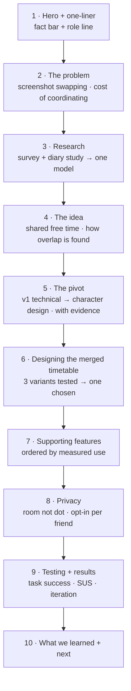
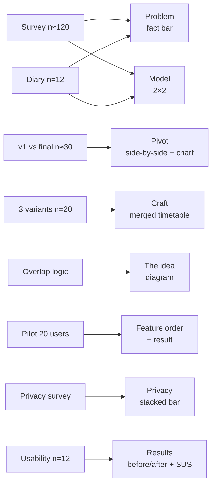

# Unify — case study upgrade plan

Plan for turning `public/unify2d.html` from a feature tour into a case study, in the
structural style of Jason Yuan's *Apple Music* and *Mercury OS* write-ups (story, a map of
the page, research condensed into models, every decision sourced, captions that carry the
findings) but at portfolio length and in a **neutral, professional voice**.
Written 2026-09-18 from an interview with Lucas. General guidance lives in the vault:
`04 Ressourcen/Design & Craft/Case Study Aufbau.md`.

> **All numbers in this file are example values** showing the *shape* of a finding and
> where it would go on the page. Replace every one with the real result before it ships.

---

## 0. What the interview established

| Topic | Answer |
|---|---|
| Context | University course project, Feb–Jun 2026, team of three |
| Lucas's role | Led concept and UX; designed v1; built the Figma and the coded prototype |
| Team's role | Sophie Meyer and Moritz Ackermann: the character ("monster") visual design, and ran the user feedback |
| Framing | Present it as teamwork. Name each person's part precisely, don't claim everything |
| Spine | **Shared free time** — seeing when friends' gaps line up |
| Hook | The three of them swapping timetable screenshots every week |
| Pivot | v1 by Lucas was technical: blue, typewriter type, harsh lines. The team's feedback round found it felt cold, like a tool. Replaced by the character-based pink design |
| Fidelity | Fully working Figma prototype plus a coded prototype |
| Privacy | GPS only to detect "on campus", then room-level position; never an exact dot. Visible only to friends you opt in |
| Feasibility | Leave university data access out of the case study |
| Hardest parts | The merged timetable view, and computing the free-time overlap |
| Assets available | v1 screens (`~/Desktop/Screenshot 2026-09-18 at 03.16.23.png`, more to come), sketches and early flows, coded prototype recordings (already on the page) |
| Voice | Neutral professional |

## 1. The spine, in one line

Everything on the page should serve this sentence. Proposed hero line:

> **Unify shows you when your friends are free at the same time as you — so meeting up
> between classes stops taking a group chat.**

The current page gives six features equal weight. The rewrite makes **shared free time**
the story, and every other feature a supporting consequence of it.

---

## 2. Target page structure

What happens to the existing sections:

| Current section | Fate |
|---|---|
| At a Glance | Becomes the hero one-liner + fact bar. Keep the screenshot-swapping origin, move it into *The problem* |
| Meta grid | Keep. Change **Role** to name each person's part (see §5) |
| Colour / Typography / Characters | Fold into **The pivot** as *what replaced v1 and why*. On their own they read as a style guide; as the answer to "v1 felt cold" they become a decision |
| Final Product + six features | Collapse into **The idea** (home, timetable) and **Supporting features**, ordered by measured use (study 7) |
| Settings / Profile | Shrink to one line inside Privacy (opt-in friends list) unless a study says otherwise |

---

## 3. Research programme

Nine studies. Each entry says **why**, **how**, **what to measure**, **what to show**, an
**example result**, and **what it changes on the page**. That last column is the point:
a study only earns space if it caused a decision.

### Study 1 — Problem survey

- **Why:** put a number on the hook. "We swapped screenshots" is anecdote until others do it too.
- **How:** online survey, ~120 students across faculties. 8–10 questions.
- **Questions:** How do you find out when friends are free? (screenshots / texting / memory / don't) · How many messages does it take to arrange one meetup between classes? · How often did you miss a free overlap you'd have used? · Do your friends study different subjects?
- **Show:** a fact bar under the problem, plus one horizontal bar chart "How students coordinate free time".
- **Example result:** 58 % coordinate by texting or screenshots; median 7 messages per meetup; 64 % have close friends in other subjects.
- **Page change:** these three numbers *are* the problem section. The "different subjects" figure explains why a shared timetable doesn't already exist.

### Study 2 — Coordination diary (one week)

- **Why:** the survey says people text; the diary shows what it costs.
- **How:** 12 students log every attempt to meet a friend between classes for 5 days: how many messages, how long until a decision, did it happen.
- **Show:** a small **funnel**: attempts → agreed → actually met. Plus one sentence stat.
- **Example result:** 41 attempts, 26 agreed, 17 met. Average 23 minutes from first message to a decision, for a 30-minute break.
- **Page change:** the headline problem sentence — "arranging a 30-minute coffee took 23 minutes of texting." This is the Yuan-style hard number next to the personal story.

### Study 3 — Condense research into one model

Not a new study: a synthesis of 1 and 2, the equivalent of Yuan's *Hoarders vs Nomads*.

- **Show:** one 2×2 or one spectrum. Suggested axes: *how structured your week is* (fixed timetable ↔ flexible) and *how spread your friends are* (same course ↔ other faculties).
- **Example:** the quadrant "fixed timetable + friends in other faculties" holds the most missed overlaps. That quadrant is Unify's user.
- **Page change:** names the target user in one picture and justifies why the timetable, not a chat, is the core.

### Study 4 — v1 vs character design (the pivot evidence)

- **Why:** the pivot is the strongest part of the story. Show the reason with data, not just "the team felt".
- **How:** preference test, ~30 students, both designs shown on the same three screens, order randomised. Semantic differential (1–7) on pairs: *cold–warm, tool–social, serious–playful, trustworthy–untrustworthy*. Plus: "Would you share your location with friends in this app?"
- **Show:** the **side-by-side v1 vs final** (the most important image on the page) and next to it a **semantic-differential line chart**, two lines crossing.
- **Example result:** v1 scored 2.1 on *warm*, the character design 5.8. Willingness to share location: 34 % → 71 %.
- **Page change:** the pivot section. Keep v1's strengths honest (it was clear and structured) and say what survived: the information architecture and the timetable logic carried over, only the visual language changed.
- **Caption example:** "Same screens, same data. Only the visual language changed — and willingness to share location doubled."

### Study 5 — Merged timetable: three variants

- **Why:** this is the hardest design problem on the project and deserves a craft section.
- **How:** build three variants in Figma: (A) side-by-side columns per friend, (B) stacked overlay with transparency, (C) a single lane that shows only shared free slots, with friend avatars. 20 participants, task: "Find the next time at least two friends are free with you." Measure time on task, errors, preference.
- **Show:** the three variants in a row with their metrics underneath (median time, error rate). Highlight the winner in the accent colour.
- **Example result:** A 14.2 s / 30 % errors, B 11.5 s / 45 %, C 4.1 s / 5 %.
- **Page change:** the craft section *Designing the merged timetable*, told as: three options, one test, one choice, plus what C costs (you lose the full picture, so a tap expands to the full view).

### Study 6 — How the overlap is computed (explain, don't test)

- **Why:** a systems decision a reader can respect, like Yuan's Module → Flow → Space.
- **Show:** one diagram: three friends' timetables as bars → free intervals extracted → intersected → minimum length filter (e.g. ≥ 20 min) → walking time between buildings subtracted → "free together" slots.
- **Page change:** one short paragraph plus the diagram inside *The idea*. Keep it visual, don't explain code.

### Study 7 — Pilot with the coded prototype (usage)

This is the "20 users → 70 % used feature X" study you described.

- **How:** give the coded prototype to 5 friend groups (20 people) for two weeks. Log screen opens and time per screen.
- **Show:** a **horizontal bar chart of share of time per feature**, sorted. Plus meetups arranged in-app vs the diary baseline.
- **Example result:** "Who's free now" on the home screen 71 % of sessions, timetable 18 %, socials 6 %, indoor friend map 4 %, room finder 1 %. Meetups per person per week: 1.4 → 3.1.
- **Page changes:**
  - The home screen's free-now block becomes the hero video and gets its own section.
  - Features are ordered on the page by this chart, not by the app's tab order.
  - Room finder drops to one sentence — measured as rarely used, so it shouldn't take a full section.
  - The meetups figure is the result in the fact bar.

### Study 8 — Privacy perception

- **Why:** a reviewer's first question about any location feature.
- **How:** in the pilot exit survey: "Would you share: exact GPS / building / room / nothing" and "Do you want to choose per friend?"
- **Show:** one **stacked bar** of willingness per precision level.
- **Example result:** GPS 12 %, room 68 %, building 81 %; 90 % want per-friend control.
- **Page change:** the privacy section states the design (campus-only GPS, room-level, opt-in per friend) and this chart is the evidence for it.

### Study 9 — Usability test + iteration

- **How:** moderated test, 12 participants, 5 tasks: find a friend free at 12:15 · see who is in the building · add a social to your timetable · find room X · hide yourself from one friend. Record success, time, and SUS.
- **Show:** a **task-success table before and after one iteration**, and the SUS score as one big number.
- **Example result:** "hide from one friend" 42 % → 92 % after moving it from settings into the friend's profile; SUS 71 → 83.
- **Page change:** *Testing + results*. Pick the one iteration with the biggest jump and show it before/after, like Jessica Im's T1 error fix.

---

## 4. From studies to page

---

## 5. Text changes

- **Voice:** neutral and professional, first person where it describes a decision ("I led…", "we tested…"). No jokes in captions; captions state the finding.
- **Role line** in the meta grid, replacing the current generic list:
  > *Lucas Maher — concept, UX, v1 visual design, Figma and coded prototype.
  > Sophie Meyer, Moritz Ackermann — character design, user feedback sessions.*
- **Page map.** Under the hero, one line announcing the structure, the way Yuan announces his three steps: *Problem → Research → Idea → Pivot → Timetable → Results.* If the page has room, make it the sticky section nav Jessica Im uses.
- **Every decision gets a source.** Pattern: *finding → decision*. "71 % of pilot sessions started on 'who's free now', so it became the home screen's first block."
- **Say what didn't change and why.** E.g. the timetable logic survived the pivot untouched; only the visual language changed.
- **Leave out** university data access, per the interview.
- **Length:** stay under ~1,100 words of prose. The studies are evidence, not chapters; most get one sentence and one visual.
- **German:** every new key goes into both `TRANSLATIONS` blocks; check line counts like the 2026-07-30 pass.

---

## 6. Visual inventory

| # | Visual | Type | Section | Source |
|---|---|---|---|---|
| 1 | "Who's free now" in use | Video loop (exists, re-cut to 5–8 s) | Hero | Coded prototype |
| 2 | Fact bar: 3 numbers | Big numbers | Hero | Studies 2, 7, 9 |
| 3 | Screenshot-swapping chat | Photo/recreated chat thread | Problem | Your own chat, anonymised |
| 4 | How students coordinate | Horizontal bar chart | Problem | Study 1 |
| 5 | Attempt → agreed → met | Funnel | Problem | Study 2 |
| 6 | Structure × friend spread | 2×2 model | Research | Study 3 |
| 7 | Overlap computation | Step diagram | Idea | Study 6 |
| 8 | Sketches and early flows | Photo collage | Idea or Pivot | Existing |
| 9 | **v1 vs final, same screens** | Side-by-side (slider if easy) | Pivot | v1 screenshot + current |
| 10 | Warm/cold, tool/social | Semantic-differential chart | Pivot | Study 4 |
| 11 | Three timetable variants + metrics | Image row with numbers | Craft | Study 5 |
| 12 | Time per feature | Sorted bar chart | Supporting features | Study 7 |
| 13 | Willingness by precision | Stacked bar | Privacy | Study 8 |
| 14 | Task success before/after | Table + one big SUS number | Results | Study 9 |

Rules, from the vault guide:
- Motion only where the thing moves (gestures, transitions). Charts, the 2×2 and the v1 comparison are stills.
- One message per chart, stated in its caption. Direct labels, no legends. The winning option or relevant group in `#FF5C00`, everything else grey.
- Draw charts in the page's own style (VT323 labels, neumorphic surface), not pasted from a spreadsheet.
- 30-second test: headings + captions + visuals alone must tell the story.

---

## 7. Work order

- [ ] **Assets first:** export v1 at the same screens as the final design (home, timetable, map). Without matching screens the pivot image doesn't work
- [ ] Scan sketches and early flows
- [ ] Run / collect Study 1 (survey) and Study 2 (diary) → problem section
- [ ] Study 4 (v1 vs final) → pivot section, the page's centrepiece
- [ ] Study 5 (three timetable variants) → craft section
- [ ] Study 7 (pilot) → decides the feature order; do this before rewriting the feature sections
- [ ] Studies 8 and 9 → privacy and results
- [ ] Draw the diagrams (overlap logic, 2×2) and charts in the site's style
- [ ] Rewrite the copy in the new order, EN + DE
- [ ] Update the meta grid role line
- [ ] Re-cut the hero video to one 5–8 s loop of "who's free now"
- [ ] Check: every example number above replaced with a real one

## 8. Open questions

1. Which study results are already available from Sophie's and Moritz's feedback sessions, and can they be quoted directly?
2. How many v1 screens exist, and do they cover the same screens as the final design?
3. Should the teammates see and approve how their part is described before it goes live?
