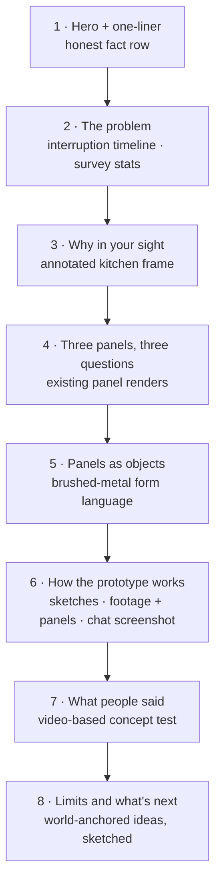

# Virtual Cooking — case study upgrade plan

Plan for turning `public/virtual_cooking2d.html` into a case study **without reworking the
project**. No new design, no new concept, no headset build. Everything here either reframes
what exists, adds material that already exists (sketches, the Claude chat screenshot), or
adds small, cheap evidence. Written 2026-09-18 from an interview with Lucas. Companions:
`unify-casestudy-plan.md`, `tomorrow-casestudy-plan.md`; general guidance in the vault at
`04 Ressourcen/Design & Craft/Case Study Aufbau.md`.

> **All numbers in this file are example values** showing the *shape* of a finding and
> where it would go on the page. Replace every one with the real result before it ships.

---

## 0. What the interview established

| Topic | Answer |
|---|---|
| Context | Self-initiated prototype and experiment. Not a uni project, not a product |
| Scope rule | **No rework.** Work with what exists; only low-effort additions |
| Assets | Sketches and early ideas; a screenshot of the Claude Code chat that built the scene; the existing renders and videos |
| Headset | None available. Nothing can be tested in AR |
| The "why" | The project is about information **in your sight**, instead of a static device you have to check manually. Not about hands-free control |
| Statistics | Add problem statistics only where they strengthen the case (they do, see Studies 1 and 2) |
| Voice | Neutral professional, same as the other two plans |

## 1. The spine, in one line

> **Virtual Cooking keeps the recipe, the quantities and the timer where you're already
> looking, so cooking stops being interrupted by a phone on the counter.**

---

## 2. What changes, and what it costs

| Change | Why | Effort |
|---|---|---|
| Add the self-observation recording (Study 1) | Gives the problem a real number and the page its best chart | One afternoon |
| Add a short survey (Study 2) | Shows the problem isn't only yours | An evening to set up |
| Add a video-based concept test (Study 3) | The only feedback possible without a headset | An evening to set up, a week to collect |
| New section: *Why in your sight* | Answers "why not voice or a tablet" with your own argument | One paragraph + one annotated frame |
| Fix the "flat VR" claim | The current text contradicts the result (see §4) | Rewrite two sentences |
| Honest status line | Say what the prototype is and isn't | One line |
| Add sketches + the chat screenshot | Process evidence that already exists | Scanning |
| Cut the tool-explanation paragraphs | The reader is hiring a designer | Delete / condense to one caption |
| New closing section: *Limits and what's next* | Shows you know the medium's real strength without building it | Two paragraphs + 1–2 quick sketches |
| Fix the role line | "Idea & Concept Designer" reads oddly on a solo project | One line |

---

## 3. Target page structure

What happens to the current sections:

| Current section | Fate |
|---|---|
| At a Glance (glance-lead) | Becomes the hero one-liner. The "I love cooking, but…" opening moves into the problem section |
| Meta grid | Role → *Solo — concept, 3D design, prototype*. Add a status row: *Prototype, desktop simulation* |
| Identifying the problem (problem-1) | Keep; add Studies 1 and 2 |
| problem-2 (panel placement) | Moves into *Three panels* |
| problem-3 (headsets too heavy) | Moves into *Limits and what's next* |
| Design process intro (process-intro) | Rewrite (see §4): the "flat VR" claim goes |
| Three panel blocks (manual, ingredients, timer) | Keep as *Three panels, three questions*. Each panel answers one question the phone used to: *Where am I?* · *How much?* · *How long?* |
| Blender / VS Code paragraphs | Condense to one caption under the prototype image. Add the chat screenshot |
| Final result (two videos) | Keep both videos; re-caption them with findings from Study 3 |

---

## 4. Text fixes (no new work, just honesty)

**The "flat VR" contradiction.** process-intro says most VR interfaces are flat 2D windows,
and that you wanted to build with depth. The result is two panels floating left and right,
which a reviewer will read as exactly those 2D windows. What you actually did differently is
**material and form**: the panels are modelled objects with thickness, bevels and brushed
metal, not flat screens. Say that instead. Suggested wording:

> Most VR interfaces are flat windows placed in space. These panels are modelled as physical
> objects instead — brushed metal, real thickness, bevelled edges — so they read as part of
> the kitchen rather than as a screen hovering in it.

**Honest status line**, under the hero or in the meta grid:

> Prototype: a desktop simulation — the panels are rendered in Three.js over real kitchen
> footage and driven by clicks. It has not been built for or tested in a headset.

Saying this first protects everything else on the page. A reviewer who finds it out
themselves trusts the page less.

**"Set by gesture"** (panel-timer-title) describes something the prototype simulates with a
click. Keep the title, but let the caption say "designed for a pinch gesture; simulated by
click in the prototype".

**Cut** the tool walk-through (Blender → Three.js, VS Code with Claude Code). One caption
under the prototype image covers it: *"Modelled in Blender, assembled in Three.js over
footage shot on a GoPro."*

---

## 5. Why in your sight

The one new argument section. It uses your framing, and turns the voice question into
support for it.

> Recipes are read in glances: a quantity, the next step, how long is left. On a phone, each
> glance means stopping, turning away from the stove, wiping your hands and waking the
> screen. Voice assistants remove the hands but not the interruption: you still have to ask,
> and the answer is gone after one sentence. Virtual Cooking puts the three things a recipe
> is read for into your line of sight, where they stay until you're done with them.

**Visual:** one frame of the existing GoPro footage, annotated. Mark where the phone lies on
the counter and where the eyes are while cooking (the pan), with an arrow for the head turn
each check costs. Then the same frame with the panels in view. Still images, 20 minutes of work.

---

## 6. Evidence, cheap and honest

### Study 1 — Film yourself cooking (self-observation)

- **Why:** the strongest possible problem evidence for the least work, and fully real. It turns "every few minutes I'm wiping my hands" into a measured fact.
- **How:** set up the GoPro (or a phone on a shelf) and cook three recipes you haven't cooked before, reading them from your phone as usual. Afterwards, scrub the footage and log every phone check: time, reason (quantity / next step / timer / scroll back), hands wiped yes/no, screen had to be woken yes/no.
- **Show:** an **interruption timeline**: one horizontal bar per recipe, a tick for every check, coloured by reason. Plus one sentence stat.
- **Example result:** 23 checks in a 35-minute recipe, one every 90 seconds. 14 of them for a quantity. The screen had locked 9 times.
- **Page change:** opens the problem section. Name it as n=1 plainly; it's still real data. **Caption example:** "Every tick is a moment I looked away from the pan. One recipe, 35 minutes."

### Study 2 — Short survey

- **Why:** shows it isn't only you, and adds the "new recipes" angle you mentioned.
- **How:** online form, ~100 people who cook at least weekly. Five questions:
  1. Where do you read recipes while cooking? (phone / tablet / paper / memory)
  2. How often do you check it during one recipe?
  3. Have you had to wipe your hands or wake the screen mid-step? (often / sometimes / never)
  4. Have you skipped trying a new recipe because following it while cooking is a hassle?
  5. What do you check most? (quantities / next step / timer / temperature)
- **Show:** a **fact row** of two or three numbers under the timeline, and one **sorted bar chart**: "What people check most".
- **Example result:** 78 % read recipes from a phone. 64 % wake the screen mid-step at least sometimes. 31 % have skipped a new recipe because of it. Quantities checked most (46 %).
- **Page changes:**
  - The fact row sits under the interruption timeline.
  - "What people check most" justifies the three-panel split. If quantities win, the ingredients panel's serving-size control is the headline feature.

### Study 3 — Video-based concept test (no headset needed)

- **Why:** without a headset this is the only feedback possible, and it's honest about being a concept test, not a usability test.
- **How:** an online form with the two existing result videos embedded (or a 40-second cut of both), shown to ~20 people who cook regularly. Questions:
  - Could you follow a recipe with this without looking away? (1–5)
  - Which panel would you use most?
  - What's the first problem you see? (open question)
  - Would you rather use this or your phone, if headsets were light?
- **Show:** one **big number** (e.g. the share who'd rather use it than the phone, if headsets were light), and **2–3 short quotes**, especially the concerns.
- **Example result:** 70 % would prefer it to a phone if headsets were light. Most-used panel: ingredients. Top concerns: steam and heat (8 mentions), weight (6), wearing it near knives (4).
- **Page changes:**
  - The result videos get captions with these findings instead of descriptions.
  - The concerns feed *Limits and what's next* directly, so the page raises the objections itself instead of leaving them to the reviewer.

---

## 7. Limits and what's next

The closing section. It states the limits plainly and shows you know what AR is uniquely good at, **without building it**: two short paragraphs and one or two quick sketches.

**Limits** (from problem-3 and Study 3): headsets are too heavy for an hour in a kitchen; steam and heat; the prototype has not been tested in a headset.

**What's next: anchored, not floating.** The prototype places information in your sight. The next step would anchor it to the thing it belongs to:
- the timer sitting on the pot it's timing
- the next ingredient highlighted where it stands on the counter
- the quantity shown on the scale while you weigh

Sketch one of these over a frame of the existing footage. That is a single annotated image, not a new build, and it shows you know where the concept goes next.

---

## 8. Visual inventory

| # | Visual | Type | Section | Source | Effort |
|---|---|---|---|---|---|
| 1 | Hero render | Existing (`side_v1_final_V1.png`) | Hero | On the page | None |
| 2 | **Interruption timeline** | Tick chart, one bar per recipe | Problem | Study 1 | Low |
| 3 | Survey fact row | 2–3 big numbers | Problem | Study 2 | Low |
| 4 | What people check most | Sorted bar chart | Problem | Study 2 | Low |
| 5 | Kitchen frame: phone vs panels | Two annotated stills | Why in your sight | Existing footage | Low |
| 6 | Three panel renders | Existing | Three panels | On the page | None |
| 7 | Sketches | Scan / photo collage | Prototype | Existing | Low |
| 8 | Claude Code chat | Existing screenshot, cropped to the key exchange | Prototype | Existing | None |
| 9 | Blender + in-scene views | Existing | Prototype | On the page | None |
| 10 | Result videos | Existing, re-captioned | What people said | On the page | None |
| 11 | Concept test number + quotes | Big number + quote cards | What people said | Study 3 | Low |
| 12 | Anchored-timer sketch | Annotated frame | Limits and next | Existing footage + sketch | Low |

Rules, from the vault guide:
- Motion only where the thing moves: the panel interactions stay video, everything new is a still.
- One message per chart, stated in its caption. Direct labels; the accent colour for the finding, the rest grey.
- 30-second test: headings, captions and visuals alone must tell the story.

---

## 9. Work order

- [ ] **Study 1 first**: cook three recipes on camera and log the checks. One afternoon, and it decides the problem section
- [ ] Put the Study 2 survey and the Study 3 concept test online the same evening, and let both collect for a week
- [ ] Text fixes (§4): status line, "flat VR" rewrite, role line, cut the tool paragraphs. No dependencies, can happen any time
- [ ] Annotate two kitchen frames (*Why in your sight*) and sketch one anchored idea (*What's next*)
- [ ] Scan the sketches, crop the chat screenshot
- [ ] Draw the three charts in the page's style
- [ ] Restructure the page in the new order; EN + DE for every changed key
- [ ] Check: every example number above replaced with a real one
